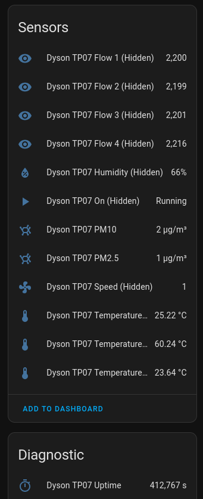

# ESPHome External Components

Repository for [ESPHome External Components](https://esphome.io/components/external_components).

Usage:

```
external_components:
  - source: github://aarongorka/esphome-components
```

## Dyson TP07 Component

Reads data from the UART debug port. Also included in the example is configuration to use an infrared transmitter to control the fan.

All credit to https://github.com/Alex-Trusk/Dyson_UART_parser for the original code; this just reimplements it for esphome.



```yaml
uart:
  - id: my_uart
    rx_pin: GPIO19
    baud_rate: 115200
    parity: NONE
    stop_bits: 1
    data_bits: 8
    rx_buffer_size: 1024

dyson_tp07:
  - id: my_dyson_tp07
    uart_id: my_uart

sensor:
  - platform: dyson_tp07
    temperature_1:
      id: my_dyson_tp07_temperature_1
      name: Dyson TP07 Temperature 1
    temperature_2:
      id: my_dyson_tp07_temperature_2
      name: Dyson TP07 Temperature 2
    temperature_3:
      id: my_dyson_tp07_temperature_3
      name: Dyson TP07 Temperature 3
    humidity:
      id: my_dyson_tp07_humidity
      name: Dyson TP07 Humidity
    flow_1:
      id: my_dyson_tp07_flow_1
      name: Dyson TP07 Flow 1
    flow_2:
      id: my_dyson_tp07_flow_2
      name: Dyson TP07 Flow 2
    flow_3:
      id: my_dyson_tp07_flow_3
      name: Dyson TP07 Flow 3
    flow_4:
      id: my_dyson_tp07_flow_4
      name: Dyson TP07 Flow 4
    speed:
      id: my_dyson_tp07_speed
      name: Dyson TP07 Speed
    uptime:
      id: my_dyson_tp07_uptime
      name: Dyson TP07 Uptime
    pm_2_5:
      id: my_dyson_tp07_pm25
      name: Dyson TP07 PM2.5
    pm_10_0:
      id: my_dyson_tp07_pm10
      name: Dyson TP07 PM10

binary_sensor:
  - platform: dyson_tp07
    is_on:
      id: my_dyson_tp07_is_on
      name: Dyson TP07 On

# Optional supporting configuration...

remote_transmitter:
  - pin: GPIO13
    carrier_duty_percent: 50%

button:
  - platform: template
    name: "Dyson TP07 Power"
    id: my_dyson_tp07_power
    on_press:
      then:
        - remote_transmitter.transmit_pronto:
            data: '0000 006D 0017 0000 0054 001E 001A 001D 001B 001E 001A 001E 001A 001E 001A 001E 001A 0039 001B 001E 001A 001E 001A 003A 001A 001E 001A 001E 001B 001C 001B 001E 001A 001E 001B 001D 001A 001D 001B 0039 001C 0039 001B 0038 001D 0039 001B 0038 001C 0181'
  - platform: template
    name: "Dyson TP07 Fan Higher"
    id: my_dyson_tp07_fan_higher
    on_press:
      then:
        - remote_transmitter.transmit_pronto:
            data: |
              0000 006D 0017 0000 0054 001D 001C 001D 001B 001D 001C 001D 001B 001D 001C 001C 001D 0039 001C 001D 001B 001D 001B 0039 001C 001D 001B 0039 001B 001D 001B 0038 001D 001D 001B 0038 001C 0039 001B 001D 001C 001D 001A 001E 001A 001D
              001C 0038 001B 0181
  - platform: template
    name: "Dyson TP07 Fan Lower"
    id: my_dyson_tp07_fan_lower
    on_press:
      then:
        - remote_transmitter.transmit_pronto:
            data: |
              0000 006D 0017 0000 0054 001D 001C 001D 001C 001D 001C 001D 001C 001D 001C 001D 001B 0038 001C 001D 001C 001D 001C 0039 001B 001D 001C 0039 001C 001D 001C 0039 001C 0039 001C 001C 001D 001D 001C 001D 001C 001D 001C 0039 001C 0039
              001C 0039 001C 0181
  - platform: template
    name: "Dyson TP07 Fan Direction"
    id: my_dyson_tp07_fan_direction
    on_press:
      then:
        - remote_transmitter.transmit_pronto:
            data: |
              0000 006D 0017 0000 0055 001D 001C 001D 001C 001C 001C 001D 001C 001C 001C 001C 001C 0038 001C 001C 001E 001C 001D 0038 001C 0038 001C 001D 001D 001C 001D 001C 001C 001C 001D 0038 001D 001C 001D 001C 001D 0038 001D 0038 001D 001C
              001D 001C 001D 0181
  - platform: template
    name: "Dyson TP07 Fan Oscillate"
    id: my_dyson_tp07_fan_oscillate
    on_press:
      then:
        - remote_transmitter.transmit_pronto:
            data: |
              0000 006D 0017 0000 0053 001E 001A 001D 001B 001E 001A 001D 001B 001D 001B 001D 001B 003A 001A 001D 001B 001D 001B 0039 001B 001E 001A 001D 001B 003A 001A 003A 001A 001D 001B 001E 001A 003A 001A 001E 001A 001D 001B 001D 001B 001E
              001A 003A 001A 0181

switch:
  - platform: template
    name: "Dyson TP07 Power"
    id: my_dyson_tp07_power_switch
    lambda: !lambda 'return id(my_dyson_tp07).get_is_on_sensor();'
    device_class: switch
    turn_on_action:
      then:
        - if:
            condition:
               - lambda: !lambda 'return !id(my_dyson_tp07).get_is_on_sensor();'
            then:
              - button.press: my_dyson_tp07_power
            else:
              - logger.log: "Already powered on, not doing anything."
    turn_off_action:
      then:
        - if:
            condition:
               - lambda: !lambda 'return id(my_dyson_tp07).get_is_on_sensor();'
            then:
              - button.press: my_dyson_tp07_power
            else:
              - logger.log: "Already powered off, not doing anything."


interval:
  - interval: 60s
    id: set_fan_state
    then:
      - lambda: |
          ESP_LOGV("DysonInterval", "Ensuring fan state matches actual state...");
          bool actual = id(my_dyson_tp07).get_is_on_sensor();
          bool reported = id(my_dyson_tp07_fan).state;
          if (actual != reported) {
            ESP_LOGD("DysonInterval", "Repoted state does not match, setting fan state to actual state...");
            auto call = id(my_dyson_tp07_fan).toggle();
            call.perform();
          } else {
            ESP_LOGV("DysonInterval", "Actual state matches reported state, doing nothing.");
          }

fan:
  - platform: template
    name: "Dyson TP07 Fan"
    id: "my_dyson_tp07_fan"
    speed_count: 10
    on_turn_on:
      - if:
          condition:
              - lambda: !lambda 'return !id(my_dyson_tp07).get_is_on_sensor();'
          then:
            - button.press: my_dyson_tp07_power
          else:
            - logger.log: "Already powered on, not doing anything."
    on_turn_off:
      - if:
          condition:
              - lambda: !lambda 'return id(my_dyson_tp07).get_is_on_sensor();'
          then:
            - button.press: my_dyson_tp07_power
          else:
            - logger.log: "Already powered off, not doing anything."
    on_speed_set:
      - lambda: !lambda |-
          auto current = id(my_dyson_tp07).get_speed_sensor();
          auto desired = x;
          auto steps = desired - current;
          if (steps > 0) {
              for (int i = 0; i < steps; i++) {
                id(my_dyson_tp07_fan_higher).press();
                delay(500);
              }
          } else if (steps < 0) {
              for (int i = 0; i < abs(steps); i++) {
                id(my_dyson_tp07_fan_lower).press();
                delay(500);
              }
          }
```
